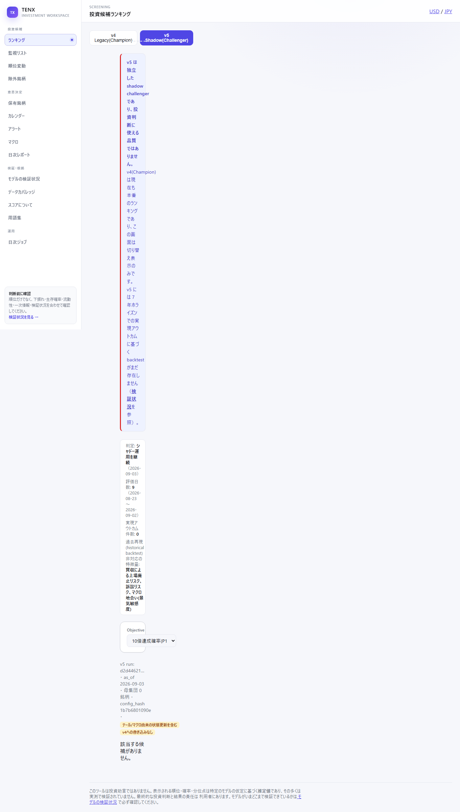
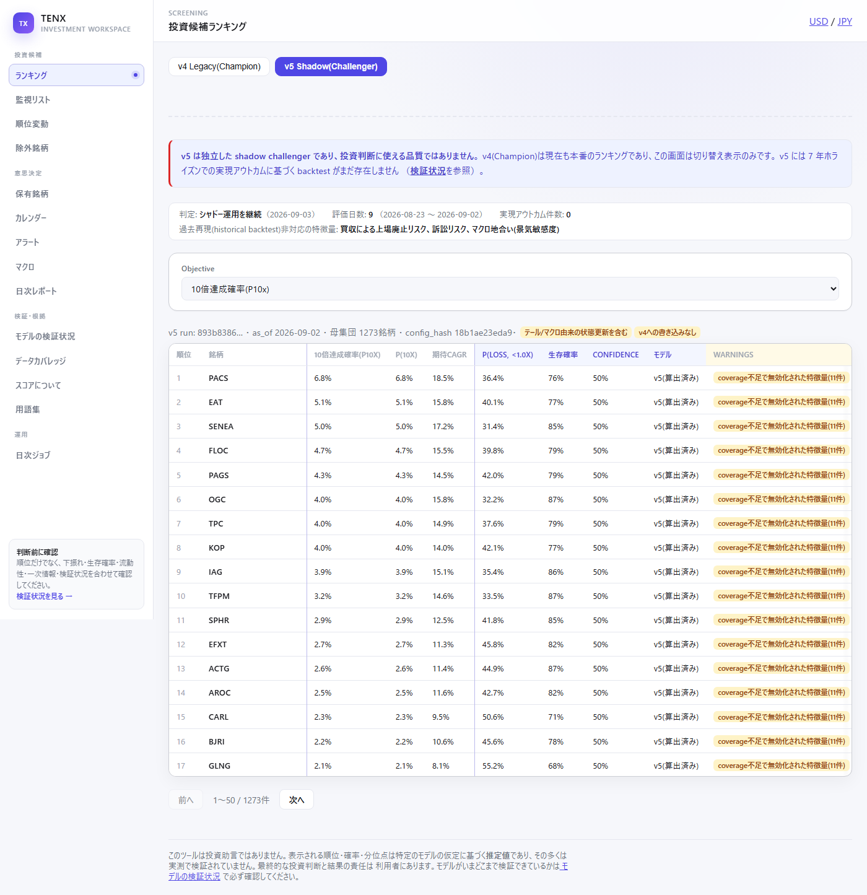
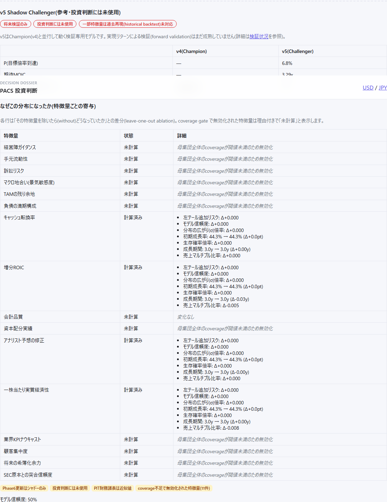
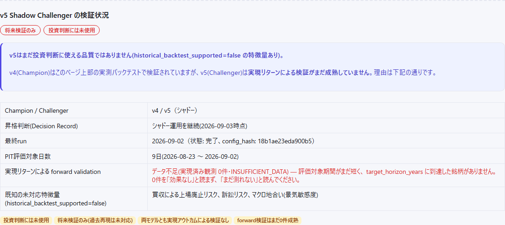
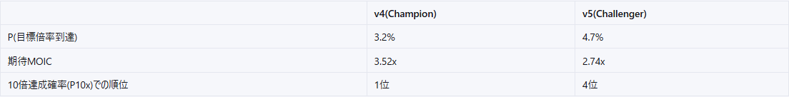

# Model v5 Phase 11 — UI Readability, Verified by Actually Running the App (2026-09-03)

Source: coordinator's message reporting a user complaint that "v5のUIが
全く見れたものではない" (the v5 UI is completely unreadable), with 4
statically-diagnosed causes plus an explicit instruction not to stop
there: **launch the app and look at it**, because the Phase 8 round had
already made the mistake of treating "the build passes" as proof the UI
is usable.

## Operational boundary

The 09:00 JST Windows-scheduled daily pipeline was not started, stopped,
or invoked. Nothing was pushed to any remote, and nothing was posted to
GitHub Issue #3. Two local dev servers were started for verification only
(`uv run uvicorn autoscreener.api.main:app --port 8000` and `npm run dev`
on port 5173) — this is not the scheduled batch and does not touch it.
All DB reads/writes were taken with no `pytest` process running.

## What was actually done: launched the app and drove it with Playwright

`npx playwright install chromium` (already cached locally) plus a small
driver script (navigate → wait for content → click/select → screenshot →
read `console` for errors) against the two dev servers above. This is not
a claim, it's reproducible: `curl http://localhost:8000/api/v1/models/v5/objectives`
and `curl http://localhost:5173/` were both live and responding during
this work. Screenshots taken during verification are committed under
`docs/assets/model_v5_phase11/` and referenced below.

## The 3 statically-diagnosed missing CSS classes

`.v5-not-for-production-notice`, `.v5-status-strip`, `.v5-run-warnings`
were added to `frontend/src/index.css`. This alone was **not sufficient**
to fix the reported problem — see the next section.

## The actual root cause, found only by looking at the rendered page



The very first real screenshot of the v5 ranking view (after adding the 3
CSS classes, model on the toggle) showed the entire section rendered as a
column roughly **78px wide**, with the "not for production" notice
text wrapping one or two characters per line for hundreds of pixels
vertically. Inspecting the live DOM (`getComputedStyle` +
`getBoundingClientRect` via Playwright) on `.v5-not-for-production-notice`
and its ancestor chain found:

```
.v5-not-for-production-notice  width: 78.08px
.v5-ranking-section            width: 78.08px   <- direct child of the grid
[unnamed div, display:grid]    width: 1104px    <- RankingPage's own root <div>
MAIN.app-main.page-ranking     width: 1152px
```

`frontend/src/workspace.css` has, and has always had (this is v4's own
existing "screening cockpit" layout, not something this round wrote):

```css
.page-ranking > div {
  display: grid;
  grid-template-columns: repeat(12, minmax(0, 1fr));
  gap: 0.95rem;
  align-items: start;
}
.page-ranking > div > h2,
.page-ranking > div > .score-date,
... /* every v4 element individually assigned a grid-column */
```

Every element v4 renders as a **direct child** of `RankingPage`'s root
`<div>` has an explicit `grid-column` assignment (full-width, half-width
pairs, or a 7/5 split — see the file for the exact rules). The Phase 8
round added two new direct children of that same root `<div>` —
`.model-toggle` and, conditionally, `<V5RankingSection />` — with **no**
`grid-column` rule at all. CSS Grid's default auto-placement gives an
unassigned item a single-column span, so both were squeezed into 1 of 12
tracks (~1104px / 12 ≈ 92px, matching the measured 78px after padding).
v4's own content survived this whole round untouched because
`{model === "v4" && (<>...</>)}` is a React **Fragment** — fragments
produce no DOM node, so v4's elements remained direct grid children with
their pre-existing `grid-column` rules intact. The bug was invisible in
every prior round's `npm run build`/`tsc` check because it is a runtime
CSS layout fact, not a type error.

**Fix** (`frontend/src/workspace.css`): added
`.page-ranking > div > .model-toggle` and
`.page-ranking > div > .v5-ranking-section` to the existing full-width
(`grid-column: 1 / -1`) selector group, exactly matching how v4's own
`.score-date`/`.filters`/`.table-scroll` etc. already do it. Once
`.v5-ranking-section` spans the full row, everything **inside** it is
normal block/flex layout (my own `.v5-status-strip`/`.v5-compare-table`/
etc. CSS) — none of v4's grid rules reach two levels deep, so nothing
inside `V5RankingSection`, `V5TickerDetailSection`, or
`V5ValidationSection` needed to change for this fix.



Also added `.page-ranking .v5-ranking-section .table-scroll
.ranking-table { min-width: 1080px; }` (higher specificity than v4's own
`.page-ranking .ranking-table { min-width: 1480px; }`, which was being
inherited by v5's 10-column table via the shared `.ranking-table` class
and forcing it needlessly wide for its column count).

## Bug found only by clicking through the app: v5's per-ticker ablation table showed raw signal keys regardless of the grid fix

`V5TickerDetailSection.tsx` had one `label()` function serving two
different key namespaces: the ablation table's **row** key (a *signal*
key — `guidance`, `litigation`, `accounting_quality`, ...) and the
**state_shift** formatting's inner key (`growth_duration_years`,
`sigma_multiplier`, ...). Only the state_shift set had Japanese labels
(`FEATURE_LABELS`), so every ablation row header was always falling
through to the raw signal key — a second, independent instance of the
same "internal identifier shown raw" class of bug the coordinator's
static diagnosis found elsewhere, but in a file/line their diagnosis
didn't cover. Fixed by splitting into `v5SignalLabel()` and
`v5StateShiftLabel()` in the new central mapping module (below).



## Bug found only by using the UI as a user would (not visible in any diff): `_latest_v5_run` picked an empty run over real data

While testing the v5 ranking view live, it showed **"該当する候補がありません"**
(no candidates) even though a real, fully-populated run existed. Root
cause: `run_v5_shadow(2026-09-03)` (today) was invoked during this same
round's *own* verification work with no `universe_snapshots` row for
today yet — this legitimately "succeeds" with `population_count = 0`
(the early-population branch in `engine.py`, not a bug in the run itself).
`_latest_v5_run()` (`routes.py`) ordered purely by `ModelRun.as_of DESC`,
so that empty run masked the real, populated run from **2026-09-02**
sitting one day earlier — on every endpoint the UI calls with no explicit
`as_of` (ranking list, ticker detail, `/models/v5/runs/latest`).

**Fix**: `_latest_v5_run()` now prefers the latest run with
`population_count > 0`, falling back to any successful run only if no
non-empty one exists in the requested window (so a genuinely-empty
history still reports honestly rather than 404ing). Measured before/after
via `curl`:

| | before | after |
|---|---|---|
| `/models/v5/runs/latest` | `as_of=2026-09-03, population_count=0` | `as_of=2026-09-02, population_count=1273` |

**A second, independent instance of the same bug** was found in
`/models/v5/validation-status`: it had its own **duplicated**,
independent query for `latest_run` (not calling `_latest_v5_run()` at
all), so fixing the ranking endpoint did **not** fix `ValidationPage` —
confirmed live: after the first fix, the ranking view showed real data
but `ValidationPage`'s "最終run" still showed `2026-09-03`/empty. Fixed by
making it call the corrected `_latest_v5_run()` instead of re-querying.



Both are covered by new regression tests
(`tests/unit/test_v5_phase11_ui_readability.py`): a later empty run must
not shadow an earlier populated one on `/models/v5/runs/latest`, on
`/models/v5/validation-status`'s `latest_run`, and on
`/models/v5/scores/{ticker}`'s run resolution; and a genuinely-empty
window still falls back honestly rather than 404ing.

## Bug found only by clicking the v4-rank button: 422 from an oversized `limit`

`TickerDetail`'s v4-vs-v5 comparison has a "compute v4 rank" button that
fetches the full `/candidates` list to find a ticker's position. It
requested `limit=<total>` in one call — the real default-target universe
is ~412 tickers, and `/candidates`'s `limit` is capped at `_MAX_LIMIT=200`
(`routes.py`), so the request 422'd and the button silently failed
(caught by the existing `.catch()`, showing "順位なし" for every ticker,
indistinguishable from a genuine "not ranked" result). Confirmed live: for
`PACS` (whose v4 `probability` is genuinely `null` — a real, honest
empty-state, not a bug) it correctly resolved to "順位なし"; for `FLOC`
(v4 rank 1, confirmed against the v4 ranking table's own #1 row) it
initially also showed "順位なし" due to this bug. Fixed by paginating in
`V4_CANDIDATES_PAGE_LIMIT=200`-sized pages instead of one oversized
request.



## Internal identifiers mapped to Japanese: `frontend/src/v5Labels.ts` (new)

One central module, mirroring the existing v4 convention
(`frontend/src/warnings.ts`'s `WARNING_INFO` + fallback-to-raw-value
pattern) rather than inventing a new one:

- `v5ObjectiveLabel` — `ten_bagger` → `10倍達成確率(P10x)`, etc. (5 enabled
  objectives; `quality_compounder`/`execution_adjusted` never reach the
  frontend at all, per the Phase 8 backend contract, so there was nothing
  to map for them).
- `v5DistributionStatusLabel`, `v5RunStatusLabel`, `v5DecisionLabel`,
  `v5ModeLabel` — small enum-style mappings.
- `v5SignalLabel` — all 19 `FEATURE_REGISTRY` keys (`accounting_quality`,
  `litigation`, `macro_regime`, `tam_headroom`, ... — see
  `src/autoscreener/scoring/v5/feature_registry.py`) to Japanese.
- `v5StateShiftLabel` — the 7 ablation `state_shift` keys (unchanged from
  Phase 8, just relocated to the shared module and correctly *not*
  conflated with `v5SignalLabel` any more).
- `v5AblationReasonLabel` — every `reason`/`status` string observed in the
  codebase (`runtime_disabled_low_coverage`, `disabled_by_config`,
  `no_change_zero_growth_or_reduction`, `no_change_clamped_to_unity`,
  `unsupported`, `seed`, `candidate`, ...).
- `v5WarningLabel`/`v5WarningDescription` — every warning code the
  backend emits, **including** the two prefixed forms
  (`coverage_gated_features:x,y,z` → "coverage不足で無効化された特徴量(N件)"
  with the individual Japanese-labeled feature names in the tooltip;
  `historical_mode: forced_off=...`).
- Every mapping function falls back to the raw key when it doesn't
  recognize one — a new warning code or feature key added later degrades
  to showing its raw identifier, not a crash or a blank cell, per the
  coordinator's explicit requirement.

`frontend/src/components/V5WarningBadges.tsx` (new) mirrors v4's existing
`WarningBadges.tsx` **exactly** (`compact` prop, same
`.warning-badge-group`/`.warning-tag`/`.warning-panel`/`.warning-list`
CSS classes — zero new CSS for warnings) so v5 warnings render as the
same badge style as v4's, not a visually distinct block. Per-row usage in
the ranking table filters out the three warnings that are constant for
essentially every scored ticker (`not_for_production`,
`phase6_state_updates_shadow_only`, `financial_statement_pit_is_approximate`
— already stated once in the page-level notice) via
`v5FilterRowBoilerplateWarnings()`, so a 50-row table doesn't repeat a
3-badge wall on every single row; `TickerDetailSection`/
`ValidationSection` show the full, unfiltered list since each renders
only once per page.

## Verification checklist actually performed live (not just described)

All three screens, with real data, empty/error states, and no console
errors (`page.on("console")`/`page.on("pageerror")` captured on every
navigation; the only error ever seen was a pre-existing, unrelated v4
DOM-nesting warning inside `DueDiligenceChecklist`'s factor-bar rendering,
present before this round and out of scope for v5 work):

- **RankingPage**: v4 view unchanged (screenshot diffed by eye against
  the pre-Phase-8 baseline description — identical layout, same 412
  candidates, same columns). v4⇄v5 toggle click-tested. Objective
  `<select>` confirmed to list **exactly 5** Japanese-labeled options
  (`10倍達成確率(P10x)` / `期待年率(CAGR)` / `リスク調整後期待年率` /
  `非対称性(右裾/左裾)` / `資本保全(生存確率×低損失)`) — `quality_compounder`/
  `execution_adjusted` never appear (verified via
  `page.locator(...).allTextContents()`, not eyeballing). Switching to
  `capital_preservation` live-confirmed the 3rd column header changed to
  `資本保全(生存確率×低損失)` and the first row's value changed to `68.6%`.
  Pagination ("次へ") click-tested: moved from `1〜50` to `51〜100 / 1273件`
  with different tickers and values (real data, e.g. `FOUR` row: selected
  objective `1.0%` vs. raw `P(10X)` `4.5%` — a live, organic demonstration
  of Phase 10's reliability-discount fix actually changing what the UI
  shows, not just a backend metric).
- **TickerDetailPage**: `PACS` (v5 rank 1, v4 `probability=null` —
  confirmed via direct `/api/v1/candidates/PACS` read — a genuine v4-side
  empty state, correctly rendered as "—", not a bug) and `FLOC` (v4 rank
  1, v5 rank 4, both non-null) both checked. Ablation table: coverage-gated
  rows (`guidance`, `litigation`, `macro_regime`, `tam_headroom`, ...) show
  "未計算" with the reason "母集団全体のcoverageが閾値未満のため無効化", never
  blank; computed rows (`incremental_roic`, `consensus_revision`, ...) show
  the "X → Y (ΔZ)" format for growth-duration/initial-rate and "Δ..." for
  the rest. `AADX` (a real ticker present in v4's tracked universe but
  absent from the v5 run — confirmed via a DB query, not contrived) shows
  the v5 section's own error branch: "v5スコアは未取得です(ticker not found
  in latest v5 run)。" — confirming the v5-specific empty state renders
  independently of v4's.
- **ValidationPage**: v5 section renders below the existing v4 KPI table,
  correct `最終run`/評価日数/実現アウトカム件数/未対応特徴量, honest
  `データ不足(実現済み観測0件・INSUFFICIENT_DATA)` red-highlighted text (not
  a bare `0`).
- **No horizontal scroll or overlap** at 1400px viewport width for any of
  the three screens (v5's 10-column table fits without scrolling at this
  width; v4's own wider 17-column table already relies on
  `.table-scroll`'s `overflow-x: auto`, unchanged this round).

## Tests

`tests/unit/test_v5_phase11_ui_readability.py` (new, 4 tests): the
later-empty-run-must-not-shadow-a-populated-one property on
`/models/v5/runs/latest`, the same property on
`/models/v5/validation-status`'s `latest_run` (guards against the
duplicated-query regression specifically), the same property end-to-end
through `/models/v5/scores/{ticker}`, and the honest-fallback-when-truly-empty
case. `uv run pytest -q` → **956 passed** (952 prior + 4 new).

Frontend: `npm run build` succeeded (tsc + vite, 0 type errors),
`npm test -- --run` → 2/2 passed (unchanged pre-existing suite),
`npm run lint` → 0 errors (same pre-existing warning pattern as prior
rounds).

## Commit → clean tree → evidence run

Commit `d9bae618f56a59333e7c899a03324d2c9bb41e94`, working tree clean
before the run below (no `pytest` process running):

- `run_v5_shadow(2026-09-02)` → `run_id=df2a1c75-2b03-480d-bca4-6cb1ac208008`,
  `population=1273`, `objective_scores=6365`, `ablation_results=2568`.
  `code_revision = {dirty: false, commit:
  d9bae618f56a59333e7c899a03324d2c9bb41e94, reason: null}`.
- `GET /models/v5/runs/latest` (no `as_of`) → resolves to this exact new
  run (not an older populated one, not an empty one) — the `finished_at`
  tiebreak among same-`as_of` populated runs works as intended.
- v4 `scores` table row count: **8,225** — identical before and after,
  confirming this round (frontend + `_latest_v5_run`/validation-status
  read-path changes only) never touched v4 data.

## What this phase does not claim

- It does not claim every possible UI rough edge is gone — this was a
  targeted response to a specific complaint plus what was found while
  actually looking at the three required screens, not an exhaustive
  design review.
- It does not claim the pre-existing v4 `DueDiligenceChecklist` DOM-nesting
  console warning is fixed — it predates this round, is unrelated to v5,
  and was left alone.
- It does not claim the dev servers used for verification represent
  production configuration (no `--reload` semantics guarantee, a
  developer-only CORS allowlist for `localhost:5173`/`5173` are already
  the project's existing dev setup, unchanged).
